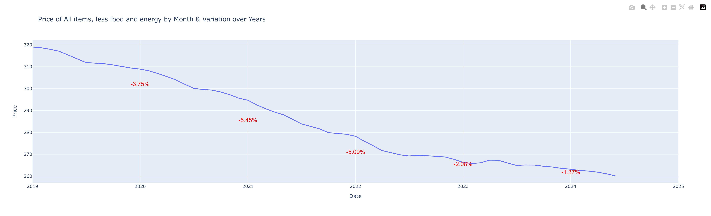

# Task JGP - Saulo Junger

To explain the execution of the tasks, I will only explain the main points, so simpler parts of the code may not be covered in this text.

## Question 1

For the first question, I left the request configuration variables as constants, even the access key, to make the code more flexible to future changes. The code is below:

```python
LINK_API = "https://api.bls.gov/publicAPI/v1/timeseries/data/"

HEADERS = {'Content-type': 'application/json'}

KEY = "7148c6266067497da3daff6cb4f28c25"

NAMES_SERIES_BY_ID = {
    "CUUR0000SA0": "All items",
    "CUUR0000SA0L1E": "All items, less food and energy",
    "CUUR0000SETB01": "Gasoline (all types)"
}

START_YEAR = 2019

END_YEAR = 2024
```

To retrieve data from the API, I created a function that makes the request based on configuration variables, processes it through the ```json.loads``` function and returns the data in json format.

```python
def get_data_json(list_series: list):
    """Make request to the API and return the series data in json
    
    - :list_series: list of series id
    - :return: series data in json
    """

    data = json.dumps({
        "seriesid": list_series,
        "registrationkey": KEY,
        "startyear": START_YEAR,
        "endyear": END_YEAR
    })

    response = requests.post(LINK_API, headers=HEADERS, data=data, timeout=1000)

    json_data = json.loads(response.text)

    return json_data
```

After retrieving the data, it is processed by the ```process_data_json``` function. The first action of the function is to iterate the retrieved dataframes and concatenate them all, using a specific column to inform the dataframe from which the data originated. This step is important, because with the dataframes concatenated vertically, it is possible to use a 'pandas' function to easily streamline the base.

```python
# list of series data in dataframe format
dfs = []

for i in range(len(list_series)):
        
    # just to shorten the name
    series_data = json_data['Results']['series'][i]

    # get data
    dfs.append(pd.DataFrame(series_data['data']))

    # get data id
    dfs[i]['nameSeries'] = NAMES_SERIES_BY_ID[series_data['seriesID']]

# concatenates all dataframe into just one to convert to pivot table
df = pd.concat(dfs)
```

After that, I pivot the base using the ```pandas.pivot_table``` function as said before and then create a column for the date, to make it easier to read the data types in the future.

```python
df = pd.pivot_table(df,
    values="value",
    index=['year', 'period'],
    columns=['nameSeries'],
    aggfunc='mean'
).reset_index(drop=False)

# create date column
df['date'] = pd.to_datetime(dfs[0]['period'].apply(lambda month: month[1:]) + '/' + dfs[0]['year'], format='%m/%Y')
    
df.drop(['year', 'period'], axis=1, inplace=True)
```

Finally, the base is exported to csv.

## Question 2

From my understanding of question 2, the objective was to be able to visualize the trend per month over the years, from 2019 to 2024, also informing the percentage variation over the years. I understood 'percentage variation over the years' as the percentage variation in average prices per year. Therefore, I show the price for each month over the years, highlighting for each year the percentage variation compared to the previous year.

The code is quite simple, so I only provide the visualization result below:



## Question 3

The process of automating the extraction, processing and loading of data depends largely on the purpose, but for this task let's assume that we always need the data to be as up-to-date as possible. As the process would have to be automatic, we could not run it on a personal computer, so a first step would be to hire a server to host a virtual machine that would run the python script. Having the virtual machine and the python script, we would only need to use a task scheduling tool so that the execution takes place at the correct time. Some attention that we would have to pay is the volume of data extracted, as it can impact the cost of the server, and the correct execution of the data, we would also need to create automatic ways of confirming that the data to be extracted is in fact new, if it is not it should an alert will be issued for appropriate actions. Finally, as the data is public, I was not concerned with information security, but thinking in a context of private data, actions should be taken into consideration to guarantee the reliability and integrity of the data.

## Question 4

For this issue there are two possibilities of reports, the first would be a more long-term verification, comparing prices during the pandemic and the trend after it, while another possibility would be an analysis of short-term price trends, from the year of 2022. I chose the second option, in order to help with more immediate decisions. As a result, I created a graph with prices per month, highlighting the trend, decrease or increase, for each year. Through the graph, it is possible to see that there was a decreasing trend in 2022 and an increase in 2023, in addition, 2024 seems to be having a decreasing trend as well.

 by Month & VVariation Trend per Year")

## Bonus Question

For this task I made something simple: a function that returns the prices of a specific series that you want, as long as it is present in our database.

```python
@app.get("/series/{series_id}")
def get_series_by_series_id(series_id: str):
    """Get data from a series_id
    
    - :series_id: series_id present in database
    - :return: dict in format {'status': value, 'name': value:, 'data': data}
    """

    if series_id not in NAMES_SERIES_BY_ID:
        return {"status": "Erro", "description": "series_id doesnt exist in database"}

    series_name = NAMES_SERIES_BY_ID[series_id]

    df = pd.read_csv("./exports/pivot_table_series.csv", parse_dates=["date"], sep=";")

    df = df[['date', series_name]].rename(columns={series_name: 'price'})

    return {
        'status': 'ok',
        'name': series_name,
        'data': df.to_dict(orient='records')
    }
```